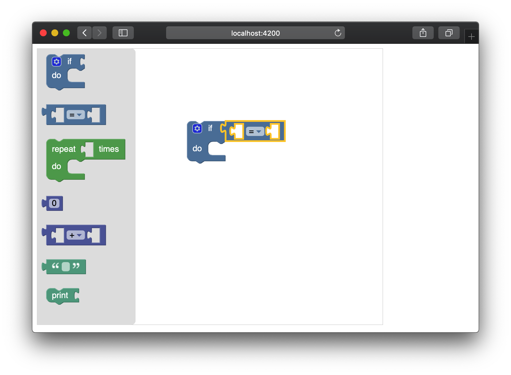

# Angular 与 Blockly 结合

## 相关依赖

blockly ：

[https://www.npmjs.com/package/blockly](https://www.npmjs.com/package/blockly)

## 运行命令

```
# 下载依赖
npm install

# 运行
npm start
```

```localhost:4200``` 在浏览器中访问，界面的截图如下 :




